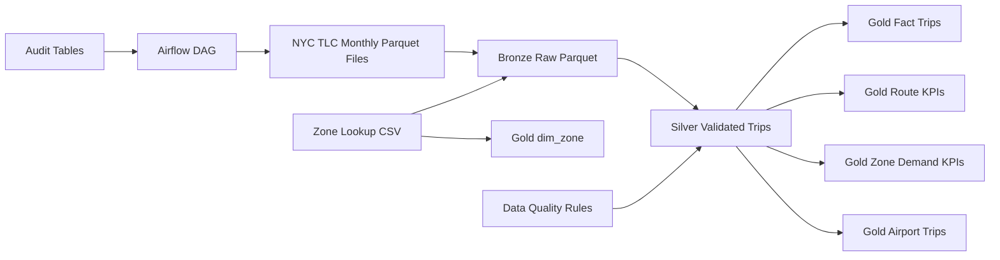

# NYC Mobility Lakehouse

## Business Problem

Transportation and operations teams need reliable trip, route, fare, demand, and zone-level KPIs from high-volume taxi trip data. This project builds a production-style lakehouse over NYC taxi trip data.

## Dataset

NYC Taxi & Limousine Commission trip records are published as monthly public Parquet files, plus a small reference CSV mapping the 265 pickup/dropoff zone IDs to borough and zone names. This build uses real **May 2024 Yellow Taxi** data: **3,723,833 trip records**.

> **Note on sourcing:** the official TLC distribution endpoint (`d37ci6vzurychx.cloudfront.net`) wasn't reachable from the network this build ran on. `download_tlc_months.py` and `download_zone_lookup.py` both support a `TLC_SOURCE_BASE_URL` / `TLC_ZONE_LOOKUP_URL` environment variable override so the same code can point at a verified byte-identical mirror of the dataset instead of the CDN — that's what was used to produce the numbers in this README. Default behavior with no override is the official endpoint, which is what you'd use in a normal environment or in production.

## Architecture



## Senior Engineering Features

- Monthly incremental ingestion, with gold marts dynamically unioning every ingested month rather than a fixed batch
- Idempotent partition reloads (`create or replace`)
- Bronze/Silver/Gold layout
- Invalid fare, distance, and timestamp rejection — including a meter-clock-error rule added after finding real out-of-range timestamps in production data (see [Data Quality Report](docs/data_quality_report.md))
- Duplicate trip detection using hash keys
- Zone dimension mapping (`gold.dim_zone`)
- Partitioning by pickup year/month/day
- KPI marts for routes, zones, airport trips, revenue per mile
- Configurable source endpoint for ingestion resilience
- Backfill support
- Data reconciliation and freshness checks

## Table Design

### Bronze

Bronze is intentionally **not** a database table — it's the raw monthly Parquet files on disk, partitioned by `year=/month=`, byte-identical to what was downloaded and never mutated:

```
.data/nyc_mobility_lakehouse/raw/yellow/year=2024/month=05/yellow_2024_05.parquet
.data/nyc_mobility_lakehouse/raw/reference/taxi_zone_lookup.csv
```

This is the "dumb storage, smart transforms" half of medallion architecture — if a downstream bug corrupts silver or gold, bronze is always there to rebuild from.

### Silver

`silver.taxi_trips_{year}_{month}` — one materialized DuckDB table per ingested month:

- Typed/cleaned columns from the raw schema
- `source_file`, `ingested_at` captured at read time
- `trip_duration_minutes`, `pickup_date`/`pickup_year`/`pickup_month`
- `trip_hash_key` (md5 of vendor + timestamps + locations + amounts) for dedup
- `reject_reason` — rejected rows are **kept**, not dropped, with a reason code (`missing_timestamp`, `invalid_timestamp_sequence`, `pickup_out_of_batch_scope`, `invalid_distance`, `negative_amount`, `missing_location`)

### Gold

- `gold.fct_taxi_trips` — clean trips only (view, filters `reject_reason is null`)
- `gold.dim_zone` — 265 zones, borough, zone name, airport flag
- `gold.fct_route_kpis_daily`
- `gold.fct_zone_demand_hourly`
- `gold.fct_airport_trips`

## Results From This Build

| Metric | Value |
|---|---:|
| Raw trips ingested | 3,723,833 |
| Clean trips (passed validation) | 3,618,292 (97.17%) |
| Rejected trips | 105,541 (2.83%) |
| Route KPI rows (`fct_route_kpis_daily`) | 253,686 |
| Zone-hour demand rows (`fct_zone_demand_hourly`) | 90,473 |
| Airport trip rows (`fct_airport_trips`) | 367,489 |
| Quality gates | 5/5 passing |

Full breakdown: [Data Quality Report](docs/data_quality_report.md) · Full query outputs: [Query Results](docs/query_results.md)

## Run Locally

```bash
export PYTHONPATH=$(pwd)
export LAKEHOUSE_HOME=$(pwd)/.data

# Optional — only needed if the official TLC CDN isn't reachable from your network
# export TLC_SOURCE_BASE_URL="https://<mirror-host>/<path>"
# export TLC_ZONE_LOOKUP_URL="https://<mirror-host>/<path>/taxi_zone_lookup.csv"

pip install -r requirements.txt

python src/ingestion/download_tlc_months.py --year 2024 --start-month 5 --end-month 5
python src/ingestion/download_zone_lookup.py
python src/transformations/build_silver_trips.py --year 2024 --month 5
python src/transformations/build_dim_zone.py
python src/transformations/build_gold_marts.py
python src/quality/run_quality_checks.py
```

To add another month incrementally, run `download_tlc_months.py` and `build_silver_trips.py` for the new month, then just re-run `build_gold_marts.py` — it automatically unions every `silver.taxi_trips_*` table it finds.

## Interview Talking Point

I designed this project like a real lakehouse pipeline: raw source files are stored without mutation, silver tables enforce data contracts and deduplication, and gold marts are optimized for business questions like route profitability, airport demand, and zone-level demand forecasting. Running it against a real month of data (not synthetic test rows) surfaced a real issue — a handful of trips carrying meter-clock timestamps from 2002–2009 — which I fixed by adding a batch-scope validation rule rather than just noting it. That's the kind of thing you only find by actually running a pipeline end to end.

